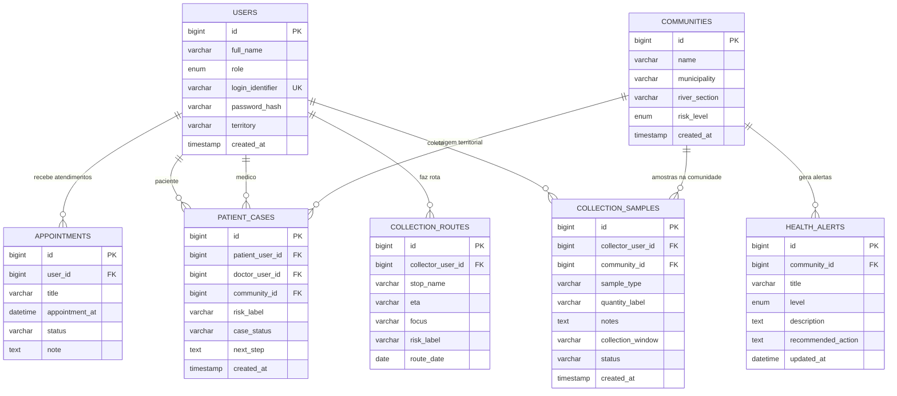

# Diagrama MySQL e Fluxo do Sistema

Este arquivo resume o banco em duas visoes:

1. `schema atual usado pela API`
2. `schema base normalizado/proposto`

Isso e importante porque hoje o projeto mistura:

- tabelas realmente usadas pela API em `server/index.js`
- um schema base mais normalizado guardado em `database/inovatech_mysql_schema.sql`

## 1. Schema atual usado pela API

Hoje a API trabalha principalmente com estas tabelas:

- `usuarios`
- `comunidades`
- `pesquisadores`
- `registros_mercuario`
- `clinical_patient_cases`
- `clinical_case_actions`
- `field_collections`
- `support_requests`
- `admin_change_log`
- `system_migrations`

## Relacionamentos fisicos reais no MySQL atual

No estado atual, o relacionamento fisico mais forte e:

- `clinical_case_actions.case_id -> clinical_patient_cases.id_caso`

Os demais relacionamentos sao em grande parte `logicos`, feitos por texto ou identificador salvo pela aplicacao.

Exemplos:

- `field_collections.collector_user_id` aponta para o usuario coletor, mas hoje nao esta com `FOREIGN KEY`
- `field_collections.community` aponta para a comunidade por nome, nao por `id_comunidade`
- `clinical_patient_cases.community` tambem e textual
- `admin_change_log` referencia tabelas por `table_name` e `record_id`

## Diagrama ER do schema atual

```mermaid
erDiagram
    USUARIOS {
        bigint id_usuario PK
        varchar nome
        enum perfil
        varchar identificador_login UK
        varchar senha
        varchar territorio
        tinyint ativo
        timestamp criado_em
        timestamp atualizado_em
    }

    COMUNIDADES {
        bigint id_comunidade PK
        varchar municipio_comunidade
        varchar territorio
        timestamp criado_em
        timestamp atualizado_em
    }

    PESQUISADORES {
        bigint id_pesquisador PK
        varchar nome
        varchar instituicao
        timestamp criado_em
        timestamp atualizado_em
    }

    REGISTROS_MERCUARIO {
        varchar id_registo PK
        varchar comunidade
        varchar tipo_amostra
        varchar risco
        timestamp criado_em
        timestamp atualizado_em
    }

    CLINICAL_PATIENT_CASES {
        bigint id_caso PK
        varchar patient_name
        varchar community
        varchar risk_label
        varchar case_status
        text next_step
        varchar priority_group
        text symptoms
        text exposure_summary
        text clinical_note
        datetime return_at
        varchar last_action
        timestamp updated_at
        timestamp created_at
    }

    CLINICAL_CASE_ACTIONS {
        bigint id_acao PK
        bigint case_id FK
        varchar doctor_user_id
        varchar action_type
        text note
        datetime return_at
        varchar next_status
        text next_step
        timestamp created_at
    }

    FIELD_COLLECTIONS {
        bigint id_coleta PK
        varchar external_id UK
        varchar community
        varchar sample_type
        varchar protocol_id
        varchar protocol_title
        text article_refs_json
        text required_fields_json
        varchar collector_user_id
        varchar collector_name
        varchar sample_status
        decimal latitude
        decimal longitude
        enum risk
        text field_note
        longtext photos_json
        timestamp collected_at
    }

    SUPPORT_REQUESTS {
        bigint id_solicitacao PK
        varchar protocol UK
        varchar selected_role
        varchar requester_name
        varchar contact_info
        text message
        varchar request_status
        timestamp created_at
    }

    ADMIN_CHANGE_LOG {
        bigint id_evento PK
        varchar table_name
        enum action_type
        varchar record_id
        varchar summary
        timestamp changed_at
    }

    SYSTEM_MIGRATIONS {
        varchar migration_key PK
        timestamp applied_at
    }

    CLINICAL_PATIENT_CASES ||--o{ CLINICAL_CASE_ACTIONS : "possui acoes"

    USUARIOS o..o{ FIELD_COLLECTIONS : "relacao logica por collector_user_id"
    COMUNIDADES o..o{ FIELD_COLLECTIONS : "relacao logica por community"
    COMUNIDADES o..o{ CLINICAL_PATIENT_CASES : "relacao logica por community"
    COMUNIDADES o..o{ REGISTROS_MERCUARIO : "relacao logica por comunidade"
    USUARIOS o..o{ CLINICAL_CASE_ACTIONS : "relacao logica por doctor_user_id"
    ADMIN_CHANGE_LOG o..o{ USUARIOS : "audita"
    ADMIN_CHANGE_LOG o..o{ COMUNIDADES : "audita"
    ADMIN_CHANGE_LOG o..o{ PESQUISADORES : "audita"
    ADMIN_CHANGE_LOG o..o{ REGISTROS_MERCUARIO : "audita"
```

## 2. Schema base normalizado/proposto

Este schema aparece em `database/inovatech_mysql_schema.sql` e representa uma modelagem mais relacional.

## Diagrama ER do schema base normalizado



## 3. Fluxo operacional do sistema

Este e o fluxo que conecta front, API e MySQL no uso diario:

```mermaid
flowchart TD
    A[Usuario acessa o frontend] --> B{Perfil}
    B -->|Morador| C[Portal publico / comunitario]
    B -->|Enfermagem| D[Painel de triagem]
    B -->|Medico| E[Painel clinico]
    B -->|Agente| F[Coleta mobile ou desktop]
    B -->|Admin| G[Area administrativa]

    F --> H[Frontend monta a coleta]
    H --> I[Salva primeiro no aparelho]
    I --> J[Envia para /api/collections/live]
    J --> K[API valida e persiste em field_collections]
    K --> L[MySQL devolve id_coleta]
    L --> M[Frontend atualiza coleta com numero oficial]
    M --> N[Mapa recalcula foco e risco da comunidade]

    D --> O[/api/nurse/cases]
    E --> P[/api/doctor/cases/:id/actions]
    O --> Q[clinical_patient_cases]
    P --> Q
    P --> R[clinical_case_actions]

    G --> S[/api/admin/*]
    S --> T[usuarios]
    S --> U[admin_change_log]
    S --> V[comunidades]
```

## 4. Leitura para apresentacao

Se voce precisar explicar isso em slide, a narrativa mais clara e:

1. `usuarios` controlam acesso por perfil
2. `comunidades` organizam a leitura territorial
3. `field_collections` guarda a operacao de campo
4. `clinical_patient_cases` e `clinical_case_actions` guardam a parte assistencial
5. `admin_change_log` registra rastreabilidade de alteracoes

## 5. Observacao importante para a equipe

Hoje o banco esta funcional, mas ainda nao totalmente normalizado no caminho operacional da API.

Se o time quiser evoluir o modelo, o passo mais importante e:

- trocar relacoes textuais por `FOREIGN KEY`

Principalmente em:

- `field_collections.community -> comunidades.id_comunidade`
- `field_collections.collector_user_id -> usuarios.id_usuario`
- `clinical_patient_cases.community -> comunidades.id_comunidade`
- `clinical_case_actions.doctor_user_id -> usuarios.id_usuario`
